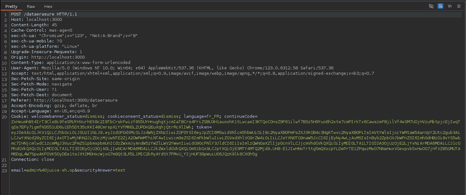
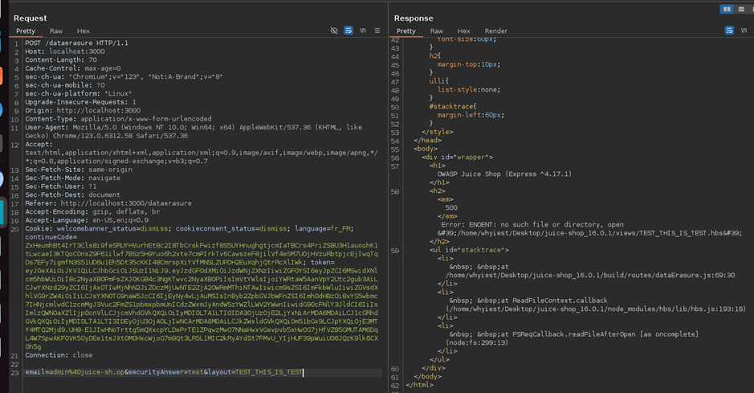

# Juice-Shop Write-up: Local File Read (LFI)

## Challenge Overview
**Title:** Local File Read (LFI)  
**Category:** Server-Side Injection  
**Difficulty:** ⭐⭐⭐⭐⭐ (5/6)  

The objective of this challenge is to exploit a local file read (LFI) vulnerability in the Juice Shop application to read sensitive files from the server.

## Tools Used
- **Web Browser:** For navigating the Juice Shop application and accessing developer tools.
- **Burp Suite:** For intercepting and modifying HTTP requests to test for injection points.
- **Fuzzer:** For automated testing of potential parameters and values.

## Methodology and Solution

### Step 1: Identifying the Vulnerable Endpoint
In a previous challenge, the endpoint `http://localhost:3000/dataerasure` was identified as potentially vulnerable. This endpoint is responsible for handling GDPR data erasure requests.



### Step 2: Sending a Test Request
1. **Navigate to Data Erasure Page:** Go to `http://localhost:3000/dataerasure` and submit a random GDPR erasure request.
2. **Intercept the Request:** Use Burp Suite to capture the HTTP POST request.

### Step 3: Analyzing the Request
The intercepted request looks like this:
```http
POST /dataerasure HTTP/1.1
Host: localhost:3000
Content-Length: 43
Content-Type: application/x-www-form-urlencoded
...
Cookie: [Your authentication cookies]
...
email=admin%40juice-sh.op&securityAnswer=test
```

### Step 4: Fuzzing the Parameters
To find the vulnerable parameter, use a fuzzer to test different parameter values. The goal is to identify any parameter that causes the server to access files from the filesystem.

### Step 5: Identifying the Vulnerable Parameter
After fuzzing, the parameter `layout` was found to be existent. A request with an invalid value for `layout` resulted in:
```http
500 Internal Server Error
Error: ENOENT: no such file or directory
```
This error indicates that the server attempted to access a file based on the `layout` parameter.



### Step 6: Crafting the Exploit
The error message suggests the server accesses files from the path `<root_directory>/juice-shop/views/<value_of_layout_parameter>`. To exploit this, we can try to read known files on the server by manipulating the `layout` parameter.

1. **Target File:** One commonly known file is `package.json`.
2. **Manipulate Parameter:** Modify the `layout` parameter to `../package.json`:
```http
POST /dataerasure HTTP/1.1
Host: localhost:3000
Content-Length: 43
Content-Type: application/x-www-form-urlencoded
...
Cookie: [Your authentication cookies]
...
email=admin%40juice-sh.op&securityAnswer=test&layout=../package.json
```

### Step 7: Sending the Exploit
1. **Send the Request:** Use Burp Suite to send the crafted request.


2. **Verify Response:** The response should include the contents of the `package.json` file, confirming the successful LFI exploit.

## Solution Explanation
The challenge was solved by identifying a local file inclusion (LFI) vulnerability in the `layout` parameter of the `dataerasure` endpoint. By manipulating this parameter to point to a known file on the server, we were able to read the contents of the file, demonstrating the vulnerability.

## Remediation
- **Input Validation and Sanitization:** Ensure all user inputs are properly validated and sanitized to prevent path traversal and file inclusion attacks.
- **Use Safe File Paths:** Avoid using user-supplied data directly in file paths. Use a whitelist of allowed files or directories.
- **Error Handling:** Improve error handling to avoid revealing detailed error messages that can help attackers craft their payloads.

