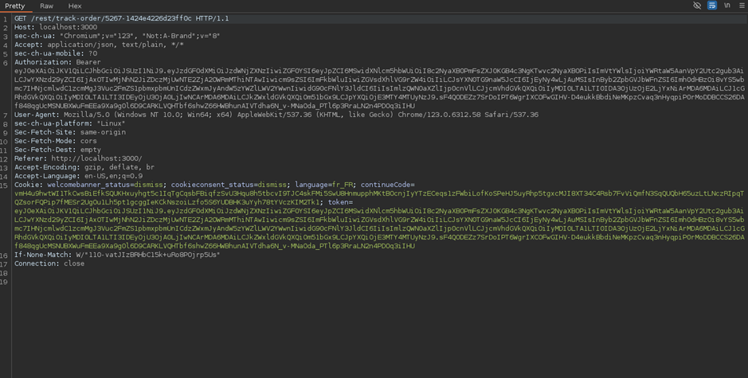
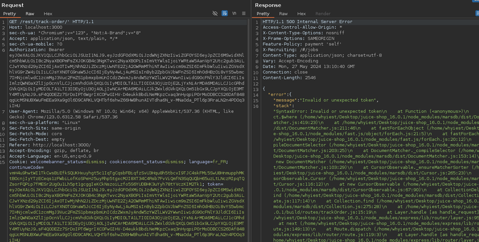
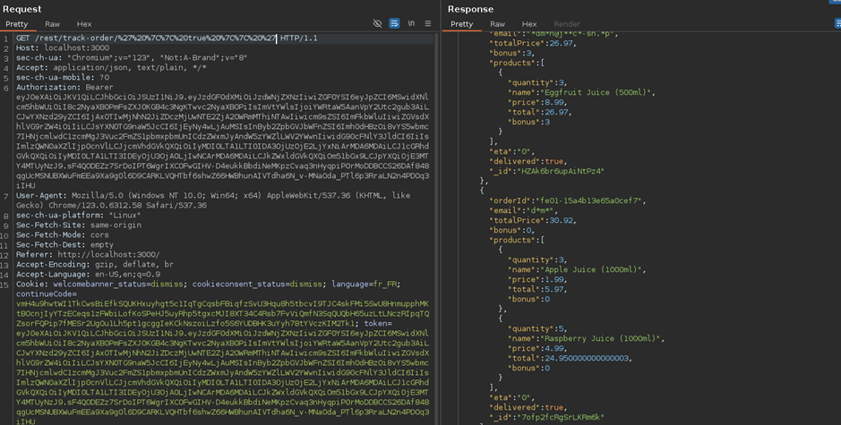

# Juice-Shop Write-up: NoSQL Infiltration

## Challenge Overview
**Title:** NoSQL Infiltration  
**Category:** NoSQL Injection  
**Difficulty:** ⭐⭐⭐⭐⭐ (5/6)  

The objective of this challenge is to exploit a NoSQL injection vulnerability in the Juice Shop application to gain access to all order histories.

## Tools Used
- **Web Browser:** For navigating the Juice Shop application.
- **Burp Suite:** For intercepting and modifying HTTP requests to test for injection points.

## Methodology and Solution

### Step 1: Identifying Potential Injection Points
The challenge involves interacting with order-related functionalities, so by extents with orders page. The following steps were taken to identify injection points:
1. **Access Order History:** Navigate to `http://localhost:3000/#/order-history` (because it's an obvious page for order) and click on one of the orders.
2. **Intercept Requests:** Use Burp Suite to intercept and analyze the requests being made when viewing an order.

### Step 2: Analyzing the API Endpoint
By analyzing the intercepted requests, we identified the following endpoint used to fetch order details:
- **Endpoint:** `/rest/track-order/[id]`



### Step 3: Testing for NoSQL Injection (Not working yet)
To test for NoSQL injection, we attempted basic payloads:
1. **Payload:** `/rest/track-order/'`



   - **Result:** Received a `500 Internal Server Error`, indicating a potential injection point.
2. **Payload:** `/rest/track-order/''`
   - **Result:** Received an `Unexpected string` error instead of `Unexpected token`, suggesting that the server interprets our input as part of a NoSQL query.



### Step 4: Crafting the NoSQL Injection Payload
Given the error messages, we inferred that the server was likely constructing a query similar to:
```javascript
{ $where: "property === '" + payload + "'" }
```
To exploit this, we crafted a payload that would always evaluate to true:
- **Payload:** `' || true || '`
- **URL Encoded Payload:** `%27%20%7C%7C%20true%20%7C%7C%20%27`

### Step 5: Injecting the Payload
1. **Inject Payload:** Modify the URL to include the payload: `/rest/track-order/%27%20%7C%7C%20true%20%7C%7C%20%27`
2. **Execute Request:** Send the request and observe the response.

### Step 6: Observing the Results
Upon injecting the payload, the server returned all orders instead of just the specific order, confirming the successful NoSQL injection.

## Solution Explanation
The challenge was solved by identifying a NoSQL injection vulnerability in the `/rest/track-order/[id]` endpoint. By injecting a payload that always evaluates to true, we were able to manipulate the query to return all orders, demonstrating the vulnerability.

## Remediation
- **Input Validation and Sanitization:** Ensure all user inputs are properly validated and sanitized to prevent injection attacks.
- **Use Parameterized Queries:** Implement parameterized queries to prevent injection by separating code and data.
- **Error Handling:** Improve error handling to avoid revealing detailed error messages that can help attackers craft their payloads.

