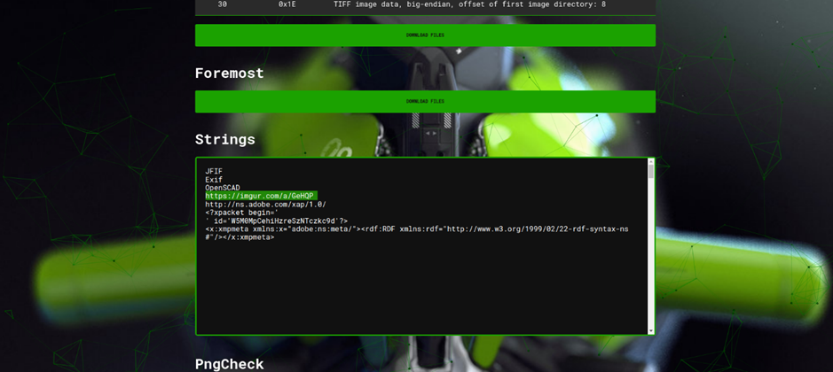

# Juice-Shop Write-Up: Retrieve Blueprint

## Challenge Overview

**Title:** Retrieve Blueprint\
**Category:** Forensic/Recon\
**Difficulty:** ⭐⭐⭐⭐⭐ (5/6)

This challenge requires to locate and retrieve a 3D blueprint related to the OWASP Juice Shop project. 

## Tools Used

- **Aperisolve**: A tool for analyzing images to extract hidden metadata, strings, or other embedded information.
- **Web Browser**: Used for accessing URLs and inspecting web content.
- **wget**: Command-line utility for downloading files from the web.
- **AperiSolv**: Tool for steganography (https://www.aperisolve.com/)

## Methodology and Solution

### Initial Reconnaissance

1. **Image Analysis**:
   - Using the hints, we know that the blueprint is not found directly within an FTP server but instead, hinted to be related to a 3D-printed item represented in an image.
   - We also know that we can take for starting point, the OWASP Juice Shop Logo 3D Printed from the product home page. We start by downloading the image of this product.
   - Analyze `3d_keychain.jpg` image located at `assets/public/images/products/3d_keychain.jpg` using Aperisolve to extract hidden metadata and strings.

### Extracting Information

2. **Follow Up on Clues**:
   - Investigate strings found in the image, specifically URLs and mentions of software used (OpenSCAD).

   

   - Check the validity and content of URLs found (Imgur and Adobe links), which led to a dead end.

### Wrong way to GitHub Repository

3. **Exploring Related Resources**:
   - Located by accident a GitHub repository (using Google Dork) containing a blueprint file (`JuiceShop_KeyChain.stl`) that matches the product image but does not immediately solve the challenge. In case you need the real 3D model, here is the link : https://github.com/OWASP/owasp-swag/blob/master/projects/juice-shop/3d/JuiceShop_KeyChain.stl

### Hypothesis and Brute Forcing

4. **Guessing File Paths**:
   - Based on the image storage path and file format (.stl), hypothesize potential URLs to directly access corresponding STL files for other related products.
   - Use common naming conventions and trial and error to guess the correct file name and path.
   - More specifically, I tried : `JuiceShop.stl`

### Successful Retrieval

5. **Downloading the Blueprint**:
   - Successfully retrieve the blueprint using `wget` by accessing the guessed URL: `http://localhost:3000/assets/public/images/products/JuiceShop.stl`.

## Solution Explanation

The challenge was resolved by utilizing a combination of image analysis, logical deduction from available metadata, and systematic guessing of file paths. The retrieval of the `JuiceShop.stl` file, not directly listed but logically named based on other files in the repository, was crucial.

## Remediation

To prevent unauthorized access to sensitive files like blueprints:

- **Secure File Storage**: Restrict public access to directories containing sensitive files and use randomized or non-predictable file names.
- **Access Controls**: Implement server-side checks to ensure only authorized users can access specific files or directories.
