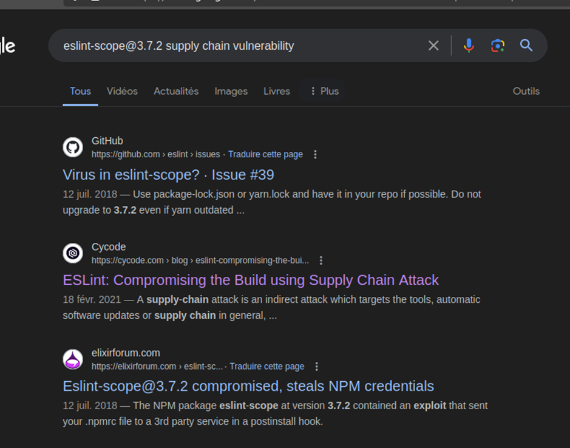

# Juice-Shop Write-up: Supply Chain Attack

## Challenge Overview

**Title:** Supply Chain Attack  
**Category:** Vulnerable Components  
**Difficulty:** ⭐⭐⭐⭐⭐ (5/6)

This challenge involves identifying a compromised package within the project's dependencies, potentially allowing an attacker to execute arbitrary code in the development or production environments.

## Tools Used

- **Web Browser:** To search for vulnerabilities related to the packages used in Juice Shop.
- **GitHub:** For sourcing the original report of the vulnerability.

## Methodology and Solution

### Step 1: Reviewing `package.json`

Examined the `package.json` file previously obtained from the Juice Shop application during a previous challenge, focusing on dependencies and development dependencies. In case you don't have this, you can obtain it from 127.0.0.1:3000/ftp, or directly from the files folder of this github repository.

### Step 2: Identifying Potentially Vulnerable Packages

Conducted a thorough review of each package listed in `package.json`, specifically looking at development tools, which are often overlooked for vulnerabilities that could lead to supply chain attacks.

### Step 3: Researching Known Vulnerabilities

Searched for known vulnerabilities associated with each package using various security databases and vulnerability trackers.More specifically, I searched for supply chain vulnerability because it's in the tittle of this challenge.

### Step 4: Discovering the Compromised Package

Identified a significant vulnerability in `eslint-scope@3.7.2`, a package used in the project. The vulnerability was detailed in a security incident report on GitHub, which explained how specific versions of `eslint-scope` were compromised to steal npm tokens.

**Vulnerability Report:** [ESLint-scope Security Issue Report](https://github.com/eslint/eslint-scope/issues/39)

### Step 5: Submitting the Vulnerability Report

Submitted the URL of the original report along with details of the affected version (`eslint-scope@3.7.2`) to the Juice Shop development team for review and remediation.

## Solution Explanation

The solution involved identifying a specific package within the Juice Shop's `package.json` that had a known vulnerability allowing for a supply chain attack. By linking the GitHub issue that detailed the attack vector and the compromised package version, I addressed the challenge criteria.

## Remediation

- **Update Compromised Packages:** Immediately update or replace the compromised `eslint-scope` package with a version that has patched the vulnerability.
- **Audit Dependencies:** Regularly audit both dependencies and development dependencies for vulnerabilities. Use tools like Snyk or dependabot to automate this process.

