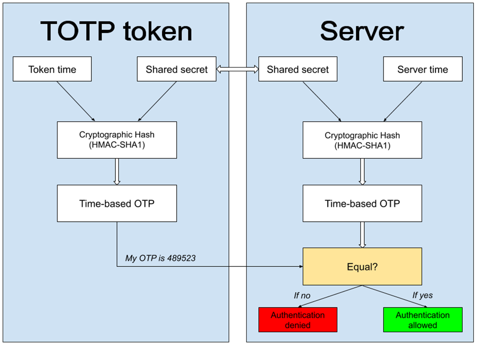
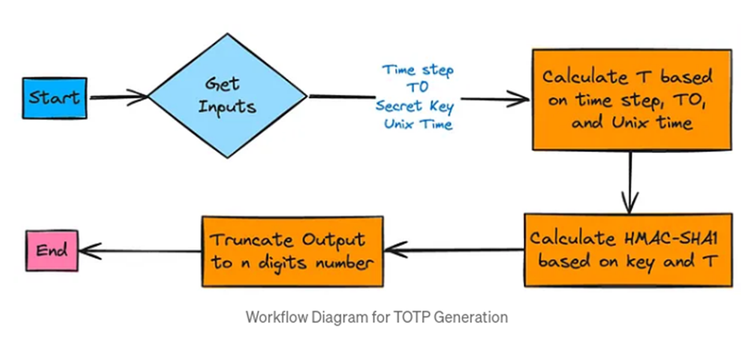
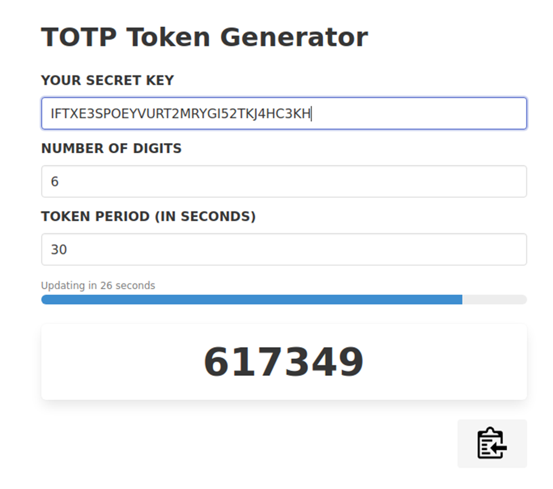

# Juice-Shop Write-up: Two-Factor Authentication Bypass

## Challenge Overview

**Title:** Two-Factor Authentication Bypass  
**Category:** Broken Authentication  
**Difficulty:** ⭐⭐⭐⭐⭐ (5/6)

The challenge requires bypassing the two-factor authentication (2FA) mechanism of the Juice Shop application by obtaining and exploiting the Time-based One-Time Password (TOTP) associated with a user account.

## Tools Used

- **SQL Injection:** To extract sensitive data from the database.
- **TOTP Generator:** Used to generate valid TOTP codes based on the extracted secret.

## Methodology and Solution

### Step 1: Understanding TOTP

Reviewed the fundamentals of TOTP, which is a common 2FA method that uses a secret key and the current time to generate a temporary passcode, usually changing every 30 seconds. The process involves hashing the time and secret key to produce a short-lived authentication code. I found this schema which explain greatly this concept : 



In summary we have the following algorigram : 



If you have not understand this concept, I suggest you to read this article : https://rublon.com/blog/what-is-totp/

### Step 2: Extracting TOTP Secret via SQL Injection

Then, I utilized a previously identified SQL injection vulnerability within the application's search feature:

**Injection Payload:**
```sql
test')) UNION SELECT username, password, role, deletedAt, isActive, totpSecret AS TOTP, id, email, profileImage FROM USERS--
```

This payload was designed to extract information about users, including their TOTP secrets, from the database.

### Step 3: Obtaining the TOTP Secret

Executed the SQL injection by embedding it in the search feature's query:
`http://127.0.0.1:3000/#/search?q=test`

The attack returned several user details, importantly including the TOTP secret for the user `wurstbot`:
- **TOTP Secret:** `IFTXE3SPOEYVURT2MRYGI52TKJ4HC3KH`

### Step 4: Generating the TOTP Code

Used a TOTP generator tool, inputting the extracted secret key and syncing it with the current UNIX time to generate a valid 2FA code.



### Step 5: Bypassing 2FA

Applied the generated TOTP code in the 2FA prompt on the login page of the Juice Shop application, successfully bypassing the two-factor authentication mechanism.

## Solution Explanation

By exploiting the SQL injection vulnerability, the TOTP secret for a user account was extracted. This secret was then used to generate a valid TOTP code, effectively bypassing the 2FA protection mechanism without any direct access to the user's authenticator device or app. This demonstrates a significant security flaw where sensitive data leakage (such as TOTP secrets) can compromise the integrity of two-factor authentication systems.

## Remediation

- **Secure Storage of Secrets:** TOTP secrets should be stored securely using encryption and should not be retrievable via injection attacks.
- **Input Validation and Sanitization:** Ensure all user inputs are validated and sanitized to prevent SQL injection.

