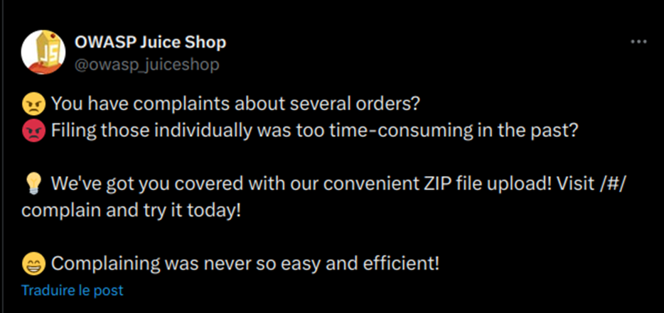

# Juice-Shop Write-up: Arbitrary File Write

## Challenge Overview
**Title:** Arbitrary File Write  
**Category:** Vulnerable Components  
**Difficulty:** ⭐⭐⭐⭐⭐ (6/6)  

The objective of this challenge is to exploit an arbitrary file write vulnerability by overwriting the `legal.md` file on the Juice Shop server.

## Tools Used
- **Web Browser:** For navigating the Juice Shop application and accessing developer tools.
- **GoBuster:** For directory and file brute-forcing to discover hidden paths.
- **Command Line Tools:** For creating a zip file with a specific directory structure to exploit the vulnerability.

## Methodology and Solution

### Step 1: Finding the File Upload Entry Points
The challenge hints point towards file upload functionalities in the application. We identified two potential pages:
1. **Complain Page:** For uploading complaint files.
2. **Profile Page:** For uploading profile pictures.

### Step 2: Identifying the Vulnerability
Using Twitter Advanced Search, we identified tweet from the Juice Shop Twitter account highlighted that the complain page now supports ZIP file uploads:
- **Tweet:** Mentioned a convenient ZIP file upload feature on the complain page.


  
We researched "arbitrary file writing using zip" on Google and found the Zip Slip vulnerability, which allows arbitrary file write by exploiting path traversal in ZIP file extraction.

### Step 3: Determining the Target File Path
The target file to overwrite is `legal.md`, located at `http://127.0.0.1:3000/ftp/legal.md`.

### Step 4: Creating the Malicious ZIP File
To exploit the Zip Slip vulnerability, we need to create a ZIP file that extracts `legal.md` to the target path:
1. **Determine the Target Path:** We need to place our `legal.md` file in the path `../../ftp/legal.md` relative to the extraction point.

2. **Create Directory Structure:**
   ```bash
   # Create a temporary working directory
   mkdir -p ~/Desktop/temp/child/child
   
   # Navigate to the temporary directory
   cd ~/Desktop/temp
   
   # Create the folder structure to simulate the target path
   mkdir -p folder/file
   cd ./folder/file
   touch legal.md
   echo "Contenu malveillant" > legal.md

   # Navigate back to root folder 
   cd ../../
   ```

3. **Add the Malicious File:**
   ```bash
   cd ./child/child
   ```

4. **Create the ZIP Archive:**
   ```bash
   zip exploit.zip ../../ftp/legal.md
   ```

This command creates a ZIP file that, when extracted, places `legal.md` at `../../ftp/legal.md` from the extraction point, effectively overwriting the target file.

### Step 5: Uploading the ZIP File
1. **Access Complain Page:** Navigate to the complain page on the Juice Shop application.
2. **Upload ZIP File:** Upload the `exploit.zip` file created in the previous step.

### Step 6: Verifying the Exploit
1. **Verify File Overwrite:** Check the content of `http://127.0.0.1:3000/ftp/legal.md` to confirm that it has been overwritten with the malicious content.

## Solution Explanation
The challenge was solved by exploiting the Zip Slip vulnerability during file upload. By crafting a ZIP file that navigates to the correct directory and overwrites the target file, we successfully demonstrated the arbitrary file write vulnerability.

## Remediation
- **Input Validation:** Ensure all file paths are properly validated and sanitized to prevent path traversal and arbitrary file write attacks.
- **Secure File Handling:** Use secure libraries for handling file uploads and extractions, and avoid extracting files to directories without proper validation.
- **User Permissions:** Restrict file write permissions to limit the potential impact of such vulnerabilities.

