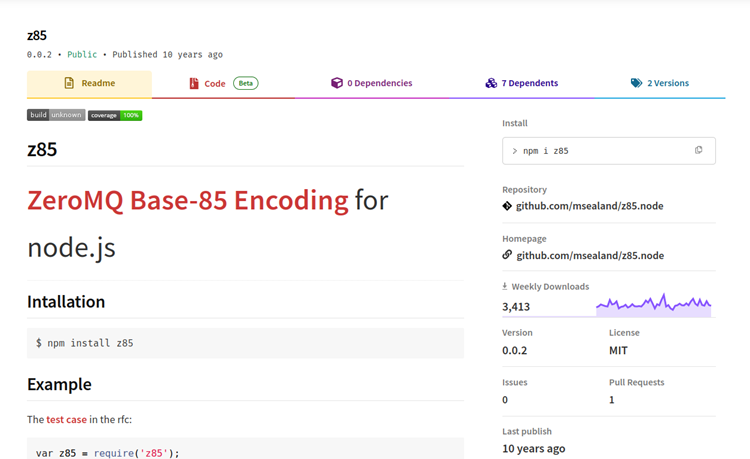
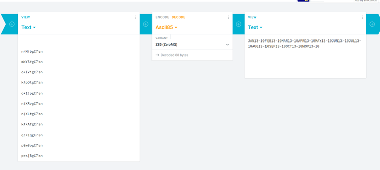

# Juice-Shop Write-up: Forged Coupon

## Challenge Overview

**Title:** Forged Coupon  
**Category:** Cryptography  
**Difficulty:** ⭐⭐⭐⭐⭐⭐ (6/6)

This challenge tasks us to perform some reverse-engineering to find the algorithm used to create discount coupons and subsequently forge a valid coupon for use within the Juice Shop application.

## Tools Used

- **Web Browser:** For interaction with the Juice Shop.
- **CyberChef:** Used for entropy analysis to evaluate the randomness of the coupons.
- **Cryptii:** Online encoder/decoder used to confirm the encoding method of the coupons.

## Methodology and Solution

### Step 1: Analyzing Existing Coupons

Initially, I started the challenge by examining a list of existing coupons retrieved from a previous challenge, which hinted at the use of cryptographic methods:

```
n<MibgC7sn
mNYS#gC7sn
o*IVigC7sn
k#pDlgC7sn
o*I]pgC7sn
n(XRvgC7sn
n(XLtgC7sn
k#*AfgC7sn
q:<IqgC7sn
pEw8ogC7sn
pes[BgC7sn
```

My idea was to retrieve a pattern to reproduce them, or decode them to understand how they work.

### Step 2: Identifying the Encoding Library

So, since I hypothesis that there is an algorithm that create theses coupons, I started to use online crypto detector to find which algorithm is used. I didn't find something, which mean that it's maybe a custom algorithm, or a not very common one. 

Knowing that, I started to review the `package.json` file, previously obtained from the FTP server, for any libraries related to cryptography or encoding. After analyzing one by one every packages, I identified the Z85 encoding library as a potential candidate due to its description on npm :



### Step 3: Decoding Coupons

Used the Cryptii online tool to decode the coupons with the Z85 algorithm, which revealed a consistent format `{3 letters of MONTH}{2 digits of YEAR}-{DISCOUNT PERCENTAGE}`.



### Step 4: Generating Forged Coupon

Generated a new coupon code for the current date with a desired discount percentage using the same Z85 encoding:

- **Original Input:** `MAY24-80`
- **Encoded Output:** `o*I]li4$`

### Step 5: Testing the Forged Coupon

Applied the newly forged coupon in a transaction within the Juice Shop. The system validated the coupon successfully, demonstrating that the forged coupon was indistinguishable from legitimate coupons.


## Solution Explanation

The use of a predictable and reversible encoding method (Z85) without additional checks or obfuscations allowed for the straightforward creation of valid coupons.

## Remediation

- **Use Secure Randomization:** Ensure that coupon codes are generated using a cryptographically secure method that cannot be easily predicted or reversed.
- **Limit Coupon Code Visibility:** Restrict the exposure of coupon algorithms or libraries in client-accessible files like `package.json` to avoid giving attackers hints about backend processes.