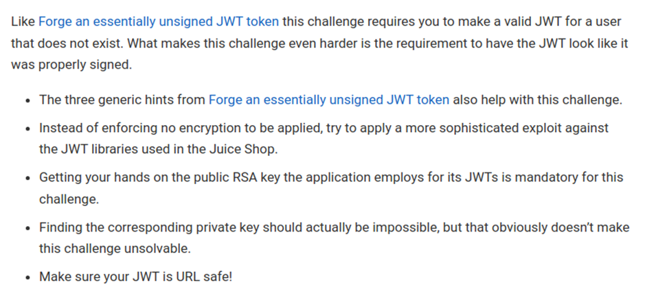
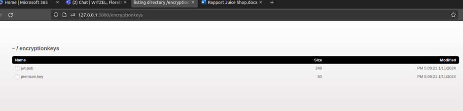
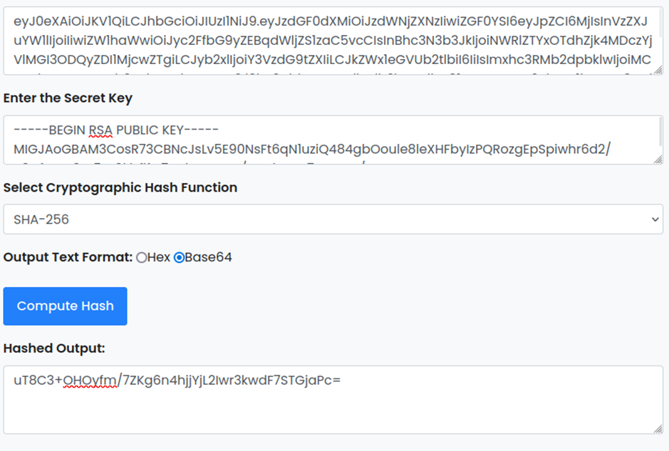
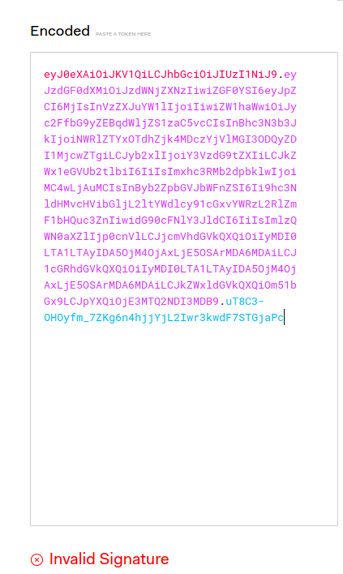
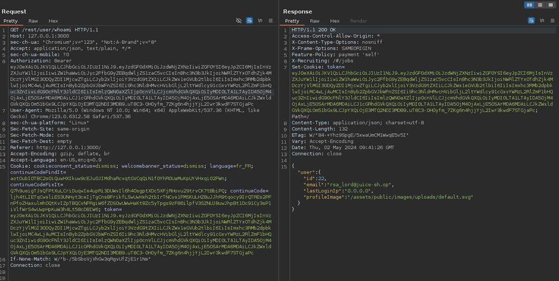

# Juice-Shop Write-up: Forged Signed JWT

## Challenge Overview

**Title:** Forged Signed JWT  
**Category:** Vulnerable Components  
**Difficulty:** ⭐⭐⭐⭐⭐⭐ (6/6)

The objective of this challenge is to create a forged JWT that appears to be correctly signed by RSA but actually uses an algorithm confusion attack to bypass security measures.

## Tools Used

- **jwt.io:** For decoding and encoding JWTs.
- **Web Browser:** Used to retrieve the public RSA key from the Juice Shop server.
- **Command Line Tools:** Such as `curl` or `wget` for interacting with the Juice Shop's API.
- **Online HMAC Generator:** To calculate HMAC signatures.

## Methodology and Solution

### Step 1: Retrieve Existing JWT

Obtained a JWT from a known user (e.g., `admin@juice-sh.op`) to use as a template for forging. For example :

```
eyJ0eXAiOiJKV1QiLCJhbGciOiJSUzI1NiJ9.eyJzdGF0dXMiOiJzdWNjZXNzIiwiZGF0YSI6eyJpZCI6MSwidXNlcm5hbWUiOiIiLCJlbWFpbCI6ImFkbWluQGp1aWNlLXNoLm9wIiwicGFzc3dvcmQiOiIwMTkyMDIzYTdiYmQ3MzI1MDUxNmYwNjlkZjE4YjUwMCIsInJvbGUiOiJhZG1pbiIsImRlbHV4ZVRva2VuIjoiIiwibGFzdExvZ2luSXAiOiJ1bmRlZmluZWQiLCJwcm9maWxlSW1hZ2UiOiJhc3NldHMvcHVibGljL2ltYWdlcy91cGxvYWRzL2RlZmF1bHRBZG1pbi5wbmciLCJ0b3RwU2VjcmV0IjoiIiwiaXNBY3RpdmUiOnRydWUsImNyZWF0ZWRBdCI6IjIwMjQtMDUtMDIgMDc6MDM6MTcuODIyICswMDowMCIsInVwZGF0ZWRBdCI6IjIwMjQtMDUtMDIgMDk6MjA6MzIuNTU4ICswMDowMCIsImRlbGV0ZWRBdCI6bnVsbH0sImlhdCI6MTcxNDY0MTY4N30.Yb2VAr9NGwR9c7WGUsKQaCKMI8sJ_Vg0mAN2pnpe1q7yj68em_X-RqPBLNFutP8eceQV5xbrb-lo5kFKlM-ympEypusk38_8koIUWO2Gip1quy_aiDEtuaq6cLK-2r7vaN-cds8cHe8c4Rg1HkG9hINPw6neYw9k0Tcy6dfAVRc
```

### Step 2: Analyze JWT Structure

Decoded the JWT using jwt.io to understand its structure, header, payload, and signature method. If you have already done unsigned JWT challenge, you are already familiar with this structure. If not, I recommend tou to start by this challenge.

### Step 3: Obtain Public RSA Key

Since we want to sign our malicious JWT that we will craft later, and as suggested by the hints of this challenges, we must first obtain the key used to sign JWT. In case if you didn't have read the hints, take a minute to read it : 



Before this challenge, I started my journey on Juice-Shop by executing a GoBuster on the web application. During this discovery step, I found the URL `http://127.0.0.1:3000/encryptionkeys` which listed the JWT public key file (`jwt.pub`). So I downloaded this file to be used later in the signature forging process.



### Step 4: Prepare Forged JWT

Modified the JWT's payload on jwt.io to impersonate a non-existent user (`rsa_lord@juice-sh.op`).

Actually, we only have a public key, so you may ask yourself : how do we will sign the JWT with it, since the private key of the server is needed ? 

There is a lot of exploits possible with JWT, but one of them consist to modify the algorithm used in the header, from an asymetric to a symetric one. If the server is misconfigured, he will accept this, and therefore, the public key can be used to sign the JWT. This attack is called "confusion attack".

To do that, we adjusted the `alg` field in the JWT header from `RS256` to `HS256` to exploit this common vulnerability in JWT implementations.

### Step 5: Sign JWT with HMAC Using RSA Public Key

Then, we want to sign the JWT. Again I suggest you to do it manually to avoid errors. We will use the RSA public key as a secret key to generate an HMAC-SHA256 signature of the JWT.



Again, as explained before, the misuse of asymmetric keys for a symmetric HMAC process is central to the algorithm confusion attack. Finally we replace older signature by the new one : 



### Step 6: Send Forged JWT to Server

Replaced the existing JWT in a request to `/rest/user/whoami` with the newly forged JWT. The server, misinterpreting the HMAC signature as a valid RSA signature, granted access as `rsa_lord@juice-sh.op`.



## Solution Explanation

The challenge was solved by exploiting a common JWT implementation flaw known as the "algorithm confusion attack." By altering the JWT header to specify HMAC-SHA256 (`HS256`) as the signature algorithm and then signing the token with the RSA public key as if it were an HMAC secret, it was possible to bypass the authentication mechanism intended to validate tokens with RSA signatures.

## Remediation

- **Strict Algorithm Enforcement:** Ensure the server enforces the use of a specific, expected algorithm for JWT signatures, rejecting any tokens that specify a different algorithm.
- **Updating Libraries:** Juice-Shop is currently using an outdated version of express-jwt which contains a lot of security issues like this one. 