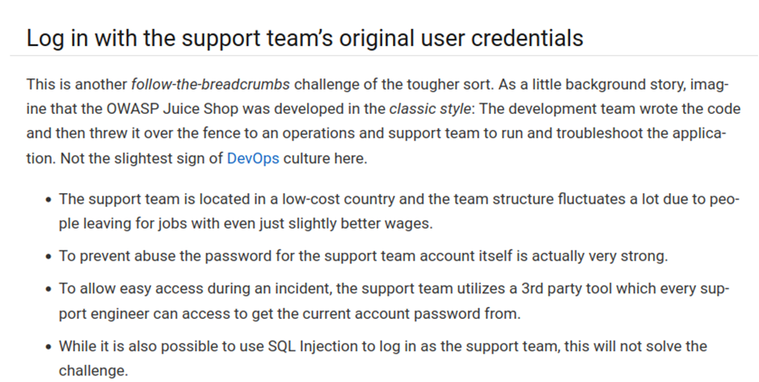
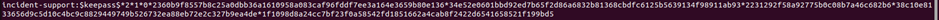
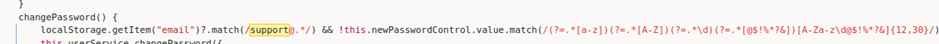
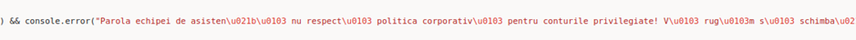
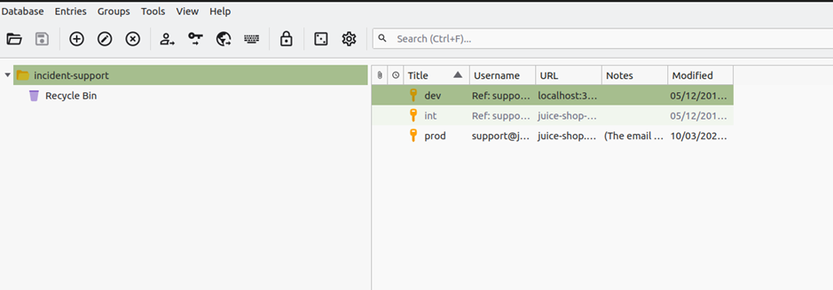
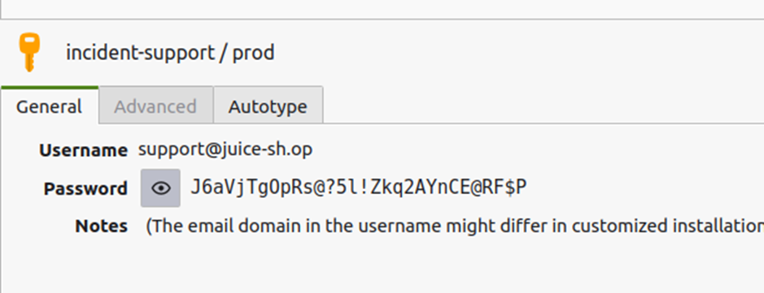

# Juice-Shop Write-up: Login Support Team

## Challenge Overview

**Title:** Login Support Team  
**Category:** Security Misconfiguration  
**Difficulty:** ⭐⭐⭐⭐⭐⭐ (6/6)

This challenge ask us to accessing the account of the support team using their original credentials, without resorting to SQL injection or other bypass methods.

## Tools Used

- **Web Browser**: Used to access the Juice Shop platform and various functionality.
- **KeePass**: A free open source password manager which helps you to manage your passwords in a secure way.
- **John the Ripper**: A popular password cracking software tool.
- **keepass2john**: A tool to extract hash values from KeePass databases for password cracking.

## Methodology and Solution

### Step 1: Identify and Download Key Files

For the completion of the challenges, hints are important :



- We discover that the team use an external secret manager to store their credentials. The most used worldwide is KeePass.
- We can't use SQL Injection
- We can't brute force the password

Since it appears that we probably need to find the password, I started to think that he might be in a file. In the Juice Shop FTP server, I located and downloaded the `incident-support.kdbx` file, which is the KeePass database for the support team. In case if you don't know what a KBDX file is, it's the database of a KeePass Secret Manager (KBD mean Keepass DataBase). For your personal knowledge, KeePass have made a major update fex years ago, but before, rather to use .kbdx file, they used .kbd. To access this database, which is encrypted with the Twofish algorithm, we must obtain the master key.

### Step 2: Convert the KeePass Database

Hopefully, Keepass database can be cracked by an offline bruteforce (which is very very fast). To do this, we will use John The Reaper. First, we have to convert the file into another file that can be use in john the reaper.

Using `keepass2john`, I converted the `.kdbx` file to a hash format that is acceptable by John the Ripper:

```bash
keepass2john incident-support.kdbx > keepasshash.txt
```



The output provided a hash which is ready to be cracked.
```bash
incident-support:$keepass$*2*1*0*2360b9f8557b8c25a0dbb36a1610958a083caf96fddf7ee3a164e3659b80e136*34e52e0601bbd92ed7b65f2d86a6832b81368cbdfc6125b5639134f98911ab93*2231292f58a92775b0c08b7a46c682b6*38c10e8133656d9c5d10c4bc9c8829449749b526732ea88eb72e2c327b9ea4de*1f1098d8a24cc7bf23f0a58542fd1851662a4cab8f2422d6541658521f199bd5
```

### Step 3: Crack the Password

Utilized John the Ripper with the `rockyou.txt` wordlist to attempt to crack the password from the hash extracted:

```bash
john --wordlist=rockyou.txt keepasshash.txt
```

This attempt was not sucessful, it looks like the password is not included in the wordlist. I tried to obtain more information about the password by searching "support" in the main.js, and I find a section related to resetting password for support team. 



We also find an error message that can show up on console if user doing something wrong. The error message is obfuscated :



It's writed in Romanian, we use google translator : "The support team password does not comply with the corporate policy for privileged accounts! Please change your password accordingly!"

We search in code for this policy, and in the same line we find a regex expression that specificy what the new password for support team must contains or not :

```
/(?=.*[a-z])(?=.*[A-Z])(?=.*\d)(?=.*[@$!%*?&])[A-Za-z\d@$!%*?&]{12,30}/
```

We can create a script python to create a wordlist accordingly, with syntax: {Majuscule letter}{letters}{number}{char}

We find that the password is `Support2022!`

### Step 4: Extract the Credentials

Once the password was cracked, I used it to unlock the KeePass database and retrieve the credentials for the support team account.



Here is the credentials : 



### Step 5: Log in to the Support Team Account

Using the credentials extracted from the KeePass database : J6aVjTg0pRs@?5l!Zkq2AYnCE@RF$P
I logged into the Juice Shop platform as the support team member.

## Solution Explanation

The credentials for the support team were securely stored in a KeePass database, which was protected by a strong password. By utilizing password cracking techniques with John the Ripper and a custom wordlist, I was able to unlock the database and retrieve the necessary credentials to complete this challenge.

## Remediation

- **Secure Sensitive Files**: Ensure that sensitive files such as password databases are not accessible through public or less-secure means like an FTP server.
- **Use Strong Access Controls**: Implement robust access controls and monitor access logs to prevent unauthorized access to sensitive information.
