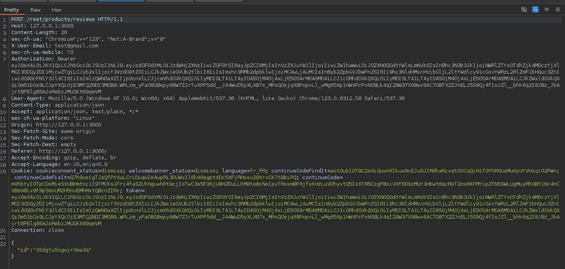
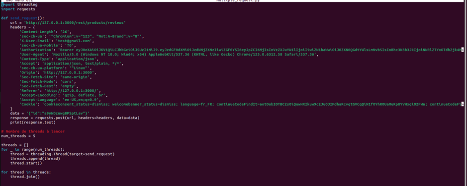
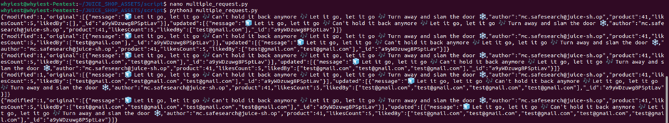
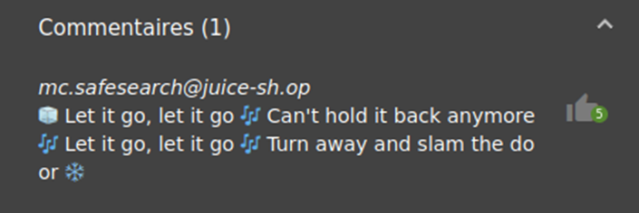

# Juice-Shop Write-up: Multiple Likes

## Challenge Overview

**Title:** Multiple Likes  
**Category:** Broken Anti-Automation  
**Difficulty:** ⭐⭐⭐⭐⭐⭐ (6/6)

This challenge requires exploiting a concurrency issue in the application's handling of like button clicks for product reviews, allowing a single user to like a review multiple times simultaneously.

## Tools Used

- **Burp Suite:** Utilized to intercept and manipulate HTTP requests.
- **Python (with the `requests` and `threading` modules):** Used to script the concurrent sending of like requests to bypass rate limiting or other anti-automation measures.

## Methodology and Solution

### Step 1: Capturing the Like Request

Using Burp Suite, I captured the HTTP POST request sent when a user likes a product review on the Juice Shop. The key parameters identified were:
- **URL:** `http://127.0.0.1:3000/rest/products/reviews/like`
- **Method:** POST
- **Data:** `{ "id": "review_id" }` (where `review_id` is the identifier of the review being liked)

### Step 2: Initial Testing

Initially attempted to manually resend the captured request multiple times using Burp's Repeater tool. This method only succeeded in registering two likes instead of the required three to complete the challenge, indicating potential server-side throttling or deduplication logic. 

Even if Burp's Repeater is fast, he is visibly not fast enough, so I need to find a way to make it faster.

### Step 3: Scripting Concurrent Requests

To overcome the limitations observed with manual resending, I scripted a solution using Python. My idea to speed-up the process it to employ multi-threading to send simultaneous requests to the like endpoint.

**Access the script:** You can find the used script in the tools folder of this repository :
- [Folder link](https://github.com/whyiest/juice-shop-write-up/tree/main/tools)
- [Script link](https://github.com/whyiest/juice-shop-write-up/tree/main/tools/multiple_likes.py)

Don't forget to add the three needed section in the script : Cookies, EMail and the most important, your bearer token. You can obtain all of them by peforming an action on Juice-Shop and capturing the request via Burp Suite or any other tool.

### Step 4: Verifying Success

After running the script, I verified in the application that the review had received multiple likes (5 in this case) from the same user at the same time.

## Solution Explanation

The successful application of multiple likes from a single user session to a single review demonstrated a flaw in the Juice Shop's handling of concurrency and rate limiting. This exploit was achieved by simultaneously sending multiple like requests before the server could process and apply the restrictions properly.

## Remediation

- **Implement Proper Rate Limiting:** Use server-side rate limiting that properly tracks and limits the rate of actions that can be taken, especially those that modify data states, on a per-user basis.
- **Concurrency Handling:** Improve the server's handling of concurrent requests to ensure actions like likes are processed in a way that prevents abuse. You can for example use locks or semaphores.
