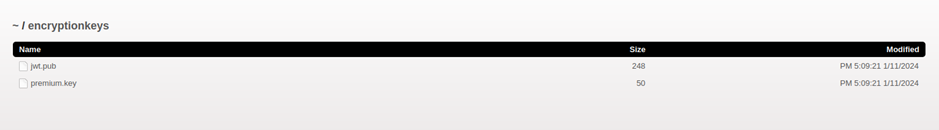
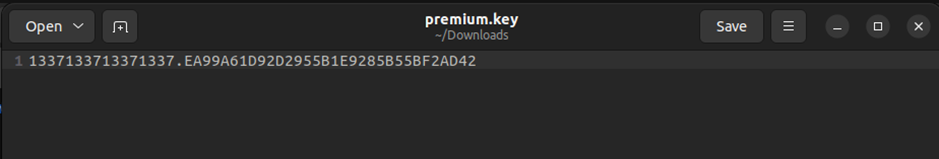

# Juice-Shop Write-up: Unlock Premium Challenge

## Challenge Overview

**Title:** Unlock Premium Challenge  
**Category:** Cryptographic Issues  
**Difficulty:** ⭐⭐⭐⭐⭐⭐ (6/6)

This challenge requires finding and using a key to access a locked section of the OWASP Juice Shop that simulates a "premium content" paywall typically found in applications and games. The goal is to unlock this section without making any actual payments.

## Tools Used

- **Web Browser**: Used to navigate the Juice Shop and download files.
- **Encryption Key Directory**: Accessed to retrieve the necessary decryption key.
- **OpenSSL**: Used for decryption of encrypted strings.

## Methodology and Solution

### Step 1: Finding the Encryption Key

As already mentionned in previous challenge, by analyzing the site with goBustery, I located an encryption keys directory:
```
http://127.0.0.1:3000/encryptionkeys
```
This directory listed a file named `premium.key`, which was promptly downloaded.



### Step 2: Analyzing the Key

Screenshot of the inside of the file : 



The content of `premium.key` seemed to be a hexadecimal string, likely used as an encryption key:

```
1337133713371337.EA99A61D92D2955B1E9285B55BF2AD42
```

This suggested its use in an AES-128 encryption scheme.

**Note:** You can retrieve this file from the files folder inside this github repository to save you some time.

### Step 3: Discovering the Encrypted Data

The challenge hinted at bypassing a payment mechanism, which led me to search for hidden comments or scripts in the application that might contain encrypted data that I can decrypt with the key that we juste obtained. Initially, 

### Step 4: Manual Search and OWASP Guide Check

I failed to find any encrypted strings directly in the site’s accessible source code. Upon reviewing the OWASP Juice Shop guide for solutions, I learned about an encrypted comment that was supposed to exist in the source code but didn't appear at the time when I've done this challenge.:
```
<!--IvLuRfBJYlmStf9XfL6ckJFngyd9LfV1JaaN/KRTPQPidTuJ7FR+D/nkWJUF+0xUF07CeCeqYfxq+OJVVa0gNbqgYkUNvn//UbE7e95C+6e+7GtdpqJ8mqm4WcPvUGIUxmGLTTAC2+G9UuFCD1DUjg==-->
```

### Step 5: Decrypting the Hidden URL

Using the AES key from `premium.key` and OpenSSL, I decrypted the above base64-encoded string:
```bash
echo "IvLuRfBJYlmStf9XfL6ckJFngyd9LfV1JaaN/KRTPQPidTuJ7FR+D/nkWJUF+0xUF07CeCeqYfxq+OJVVa0gNbqgYkUNvn//UbE7e95C+6e+7GtdpqJ8mqm4WcPvUGIUxmGLTTAC2+G9UuFCD1DUjg==" | openssl enc -d -aes-256-cbc -K EA99A61D92D2955B1E9285B55BF2AD42 –iv 337133713371337 -a –A
```
This revealed a URL hidden behind the paywall:
```
http://localhost:3000/this/page/is/hidden/behind/an/incredibly/high/paywall/that/could/only/be/unlocked/by/sending/1btc/to/us
```

### Step 6: Accessing the Hidden Content

Navigating to the decrypted URL granted access to the premium content section of the Juice Shop, bypassing the payment mechanism entirely and solving the challenge.

## Solution Explanation

The challenge was addressed by decrypting an encrypted URL using a key found in the server's exposed file directory. This method circumvented the simulated paywall, illustrating the risk of leaving sensitive keys accessible and the importance of securing payment-related features.

## Remediation

- **Secure Key Storage**: Never store encryption keys openly accessible directories or embed them within client-side code.
- **Access Control**: Implement strict access control measures to prevent unauthorized access to sensitive directories and files.
