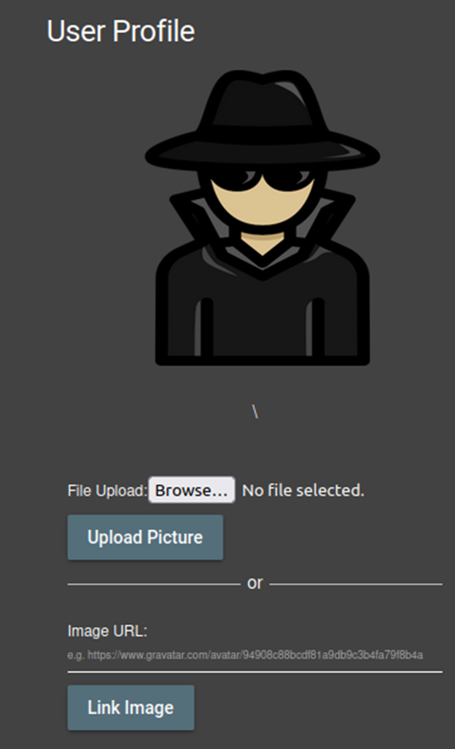
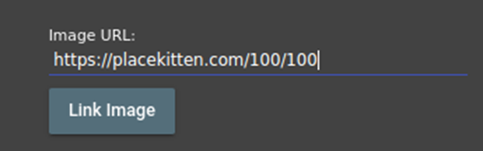
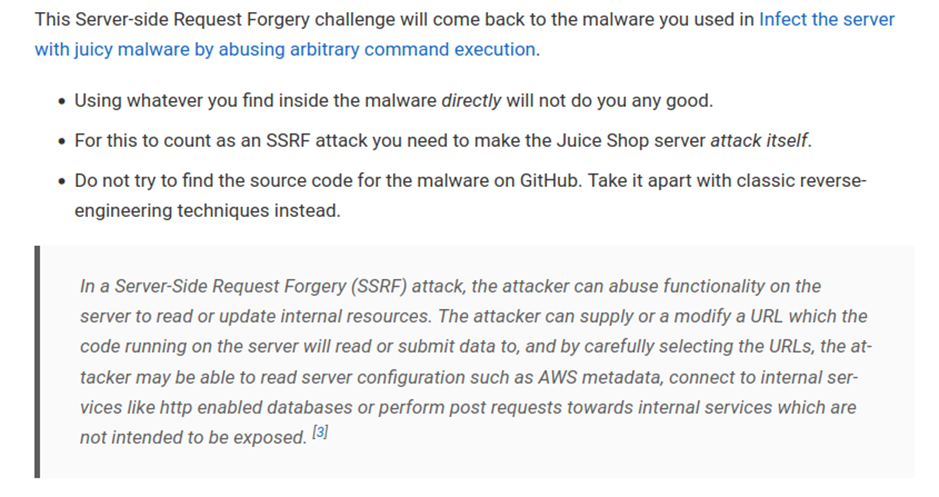
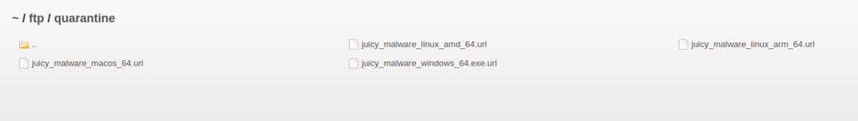

# Juice-Shop Write-up: SSRF (Server-Side Request Forgery)

## Challenge Overview

**Title:** SSRF  
**Category:** Broken Access Control  
**Difficulty:** ⭐⭐⭐⭐⭐⭐ (6/6)

This challenge involves exploiting a Server-Side Request Forgery (SSRF) vulnerability to request a hidden resource on the server via the server itself.

## Tools Used

- **Web Browser**: For interacting with the Juice Shop application and modifying profile image URLs.
- **Burp Suite**: Used to intercept and modify HTTP requests sent to the server.

## Methodology and Solution

### Step 1: Identify Potential SSRF Points

Knowing the challenge involves SSRF, I looked for places within the Juice Shop application where external URLs are fetched by the server. The user profile section, where users can set their profile image via a URL, seemed a likely candidate.



### Step 2: Testing the Theory

Using Burp Suite, I intercepted the request made when changing the profile image and observed that it accepts an external URL for the image. This behavior suggests that the server fetches the image from the URL provided by the user, which is a classic setup for SSRF vulnerabilities.



In fact, using Burp I found that my URL was directly injected in imageURL parameter of the request, which means that URL will be fetched server-side.

### Step 3: Exploring the Quarantine Directory

Here is the hints of the challenges : 



Following hints provided in the challenge description, I explored URLs contained in malware files hosted under the `/ftp/quarantine/` directory on the server. 



Each of these URLs was a potential trigger for the SSRF.

### Step 4: Manipulating the Image URL

Initially, I attempted to use the URLs directly from the malware files as the image source in the user profile to trigger the SSRF. However, these attempts did not succeed.

### Step 5: Finding the Trigger

Malwares files were the only ones that I didn't opened. So I took the decision to uncompile them to understand how they work.

Within the malware files, I noticed a specific URL:
```
http://localhost:3000/solve/challenges/server-side?key=tRy_H4rd3r_n0thIng_iS_Imp0ssibl3
```

This URL appeared to be designed specifically for this challenge, likely a trigger for the SSRF. In fact, nothing happened when I tried to only visit the URL.

### Step 6: Exploiting the SSRF

Changing the profile image URL to the one discovered in the malware file and applying the changes caused the server to make a request to the internal URL. This internal request solved the challenge.

## Solution Explanation

The server was improperly configured to fetch URLs provided by users without proper validation or restriction. By manipulating the profile image URL to an internal link, I was able to make the server request a hidden reource, demonstrating the SSRF vulnerability.

## Remediation

- **Validate and Sanitize Input**: Ensure all user-provided URLs are properly validated and sanitized to prevent the server from making unintended requests.
- **Restrict URL Fetching**: Restrict the fetching of URLs to only allow known safe domains or paths.
- **Pre-fetch client-side**: If possible, pre-fetch image client-side, and only send to server the resulting image.