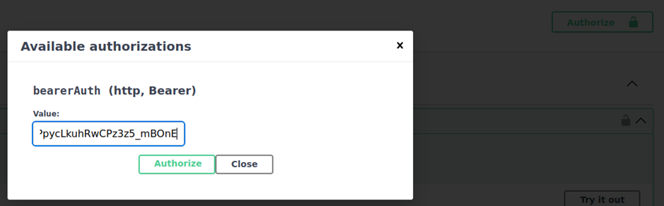
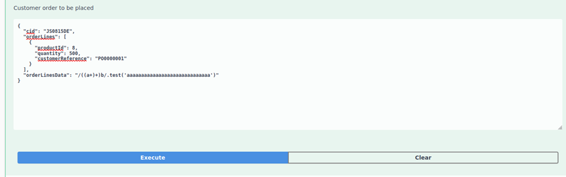
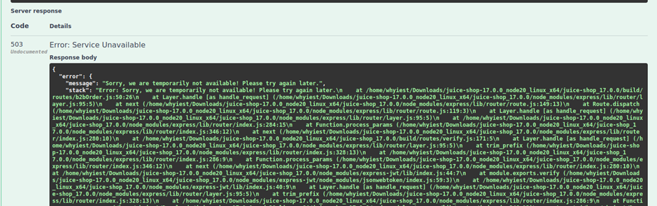

# Juice-Shop Write-up: Successful RCE DoS

## Challenge Overview
**Title:** Successful RCE DoS  
**Category:** Remote Code Execution (RCE) / Denial of Service (DoS)  
**Difficulty:** ⭐⭐⭐⭐⭐⭐ (6/6)  

The objective of this challenge is to exploit a vulnerable API endpoint to cause a denial of service (DoS) on the Juice Shop server by injecting malicious payloads.

## Tools Used
- **Web Browser:** For navigating the Juice Shop application and accessing developer tools.
- **GoBuster:** For directory and file brute-forcing to discover hidden paths.
- **Swagger UI:** For interacting with the Juice Shop API and testing payloads.

## Methodology and Solution

### Step 1: Discovering the Swagger API Documentation
Using GoBuster, we discovered the Swagger API documentation for Juice Shop at `http://localhost:3000/api-docs`.

### Step 2: Identifying the Vulnerable Endpoint
Within the Swagger UI, we identified the `/orders` endpoint, which allows adding new orders. This endpoint accepts JSON data, including an attribute called `orderLinesData` that can contain arbitrary JSON.

### Step 3: Authorizing API Requests
To make API requests, we needed to include a bearer token for authorization:
1. **Retrieve Bearer Token:** Extract the token from the browser's developer tools.
2. **Authorize Request:** Input the token in the Swagger UI to authorize the request.



### Step 4: Testing the API Endpoint
1. **Try It Out:** Click "Try it out" in the Swagger UI for the `/orders` endpoint and observe the example payload structure:
   ```json
   {
     "cid": "JS0815DE",
     "orderLines": [
       {
         "productId": 8,
         "quantity": 500,
         "customerReference": "PO0000001"
       }
     ],
     "orderLinesData": "[{\"productId\": 12,\"quantity\": 10000,\"customerReference\": [\"PO0000001.2\", \"SM20180105|042\"],\"couponCode\": \"pes[Bh.u*t\"},{\"productId\": 13,\"quantity\": 2000,\"customerReference\": \"PO0000003.4\"}]"
   }
   ```
2. **Identify Vulnerability:** Notice that `orderLinesData` allows arbitrary JSON injection, making it a potential vector for injection attacks.

### Step 5: Crafting the DoS Payload
To exploit the vulnerability, we crafted a payload designed to cause a Regular Expression Denial of Service (ReDoS):
- **Payload:**
  ```json
  {
    "orderLinesData": "/((a+)+)b/.test('aaaaaaaaaaaaaaaaaaaaaaaaaaaaa')"
  }
  ```
This payload uses a complex regular expression that leads to excessive backtracking and processing time, causing the server to hang.

### Step 6: Executing the DoS Attack
1. **Input Payload:** Replace the example payload with our ReDoS payload in the Swagger UI.



2. **Send Request:** Execute the request and observe the server's response.

### Step 7: Observing the Result
As expected, the server responded with a 503 Service Unavailable error, indicating that the payload successfully caused a DoS condition.



## Solution Explanation
The challenge was solved by exploiting a vulnerable API endpoint that allowed arbitrary JSON injection. By injecting a ReDoS payload, we caused the server to hang due to excessive processing time for the regular expression, resulting in a denial of service.

## Remediation
- **Input Validation:** Implement strict input validation and sanitization for all user-supplied data.
- **Regular Expression Safety:** Avoid using complex regular expressions that can lead to excessive backtracking and processing.
- **Rate Limiting and Timeouts:** Implement rate limiting and request timeouts to mitigate the impact of potential DoS attacks.

