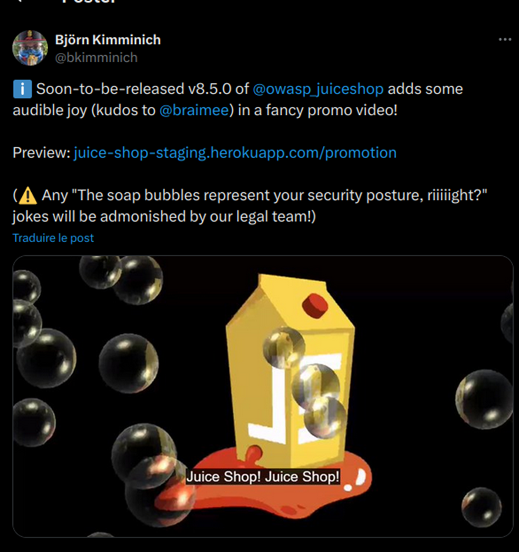
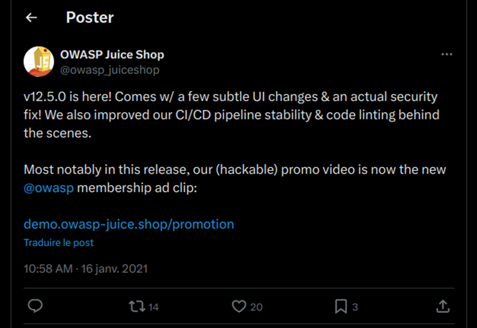
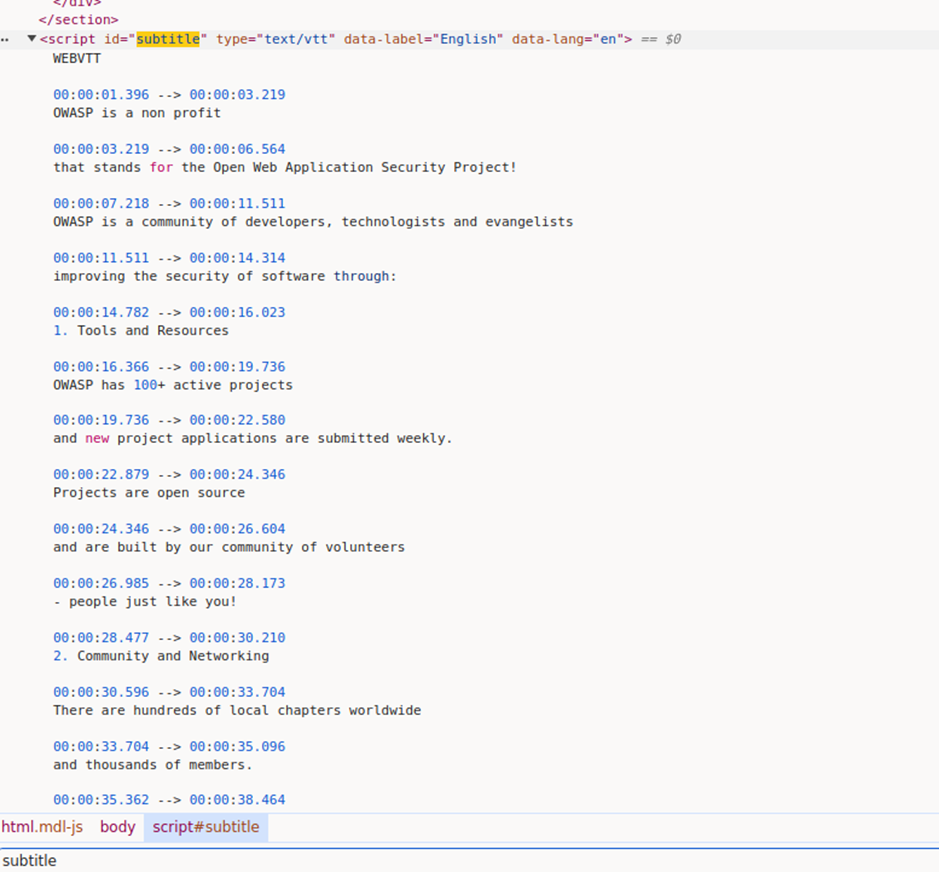
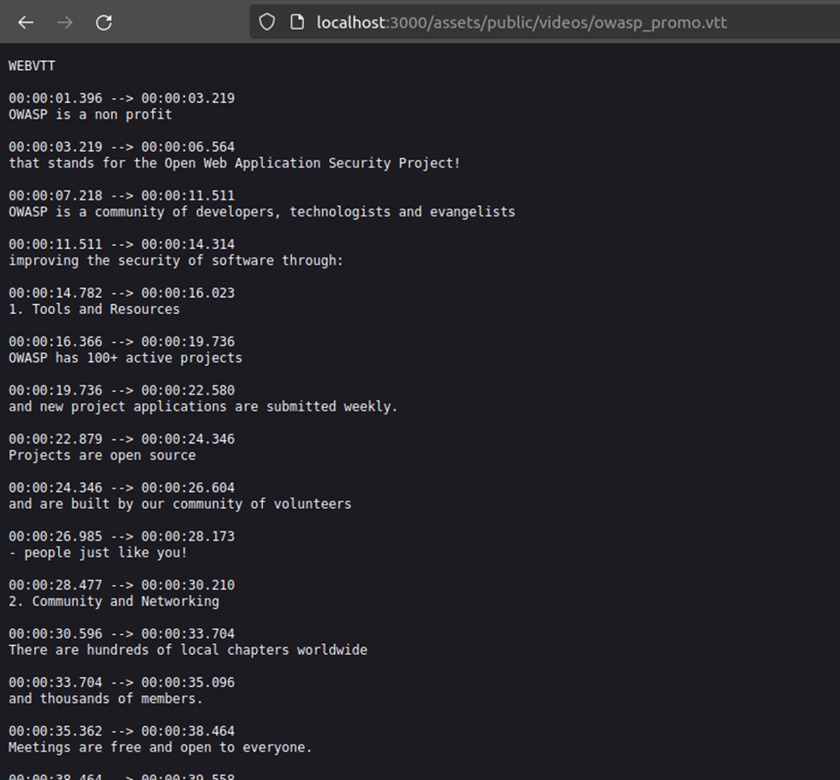
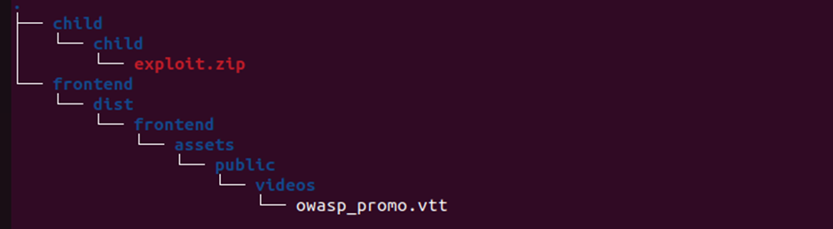
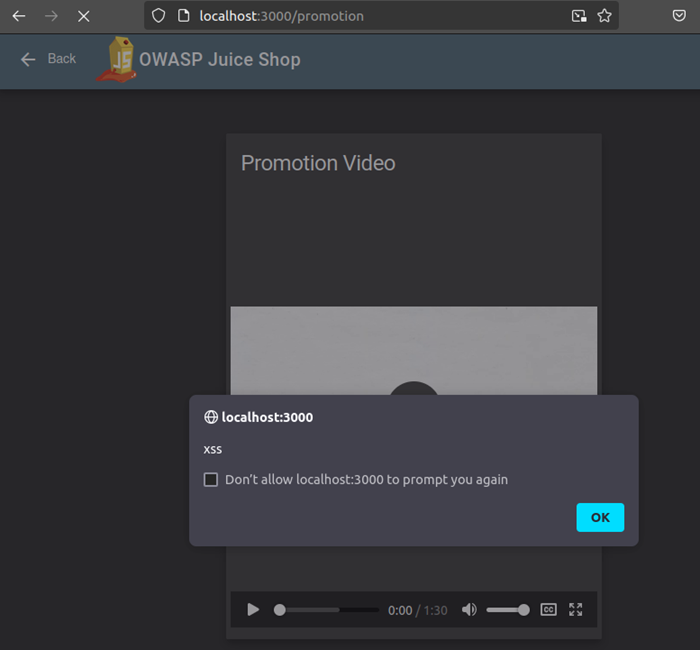
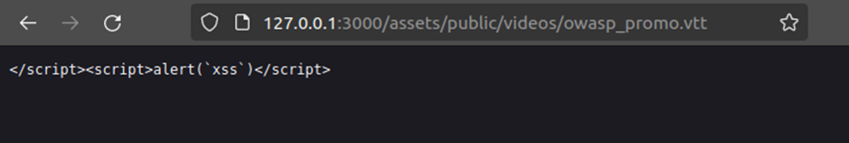

# Juice-Shop Write-up: Video XSS

## Challenge Overview
**Title:** Video XSS  
**Category:** Cross-Site Scripting (XSS)  
**Difficulty:** ⭐⭐⭐⭐⭐⭐ (6/6)  

The objective of this challenge is to embed an XSS payload (`</script>`) into the promo video of the Juice Shop application.

## Tools Used
- **Web Browser:** For navigating the Juice Shop application.
- **Developer Tools:** To inspect and manipulate HTML and JavaScript code.
- **Burp Suite:** For intercepting and analyzing HTTP requests.
- **Command Line Tools:** For creating a zip file with a specific directory structure to exploit the vulnerability.
- **Twitter Advanced Search:** To affine Tweet search (https://twitter.com/search-advanced)

## Methodology and Solution

### Step 1: Finding the Promo Video
By reading the hints we know that promo video URL is not part of the sitemap but the path is advertised somewhere. We used targeted searches to locate it:
- **Twitter Search:** Found the URL by filtering tweets by @bkimminich and @owasp_juiceshop containing keyword "promo, promotion, juice-shop, video":
  - `https://twitter.com/bkimminich/status/1114621693299916800`

  - `https://twitter.com/owasp_juiceshop/status/1350381894010077184`

- **Direct URL Access:** Using GoBuster we can also find `http://localhost:3000/promotion`.

### Step 2: Identifying the Subtitle File
Upon inspecting the promo video page using Developer Tools, and by filtering by keyword "subtitle", we observed that subtitles were loaded using a WebVTT file format:

We also find in developer tool the source of the video : the /video page, located to http://127.0.0.1:3000/video.

- **Video Source:** Inside a response header (Content-location) of the server when visiting 127.0.0.1:3000/video, we identify the video source as `http://localhost:3000/assets/public/videos/owasp_promo.mp4`.
- **Subtitle Source:** We are searching the subtitle file, we know that WebVTT extension is .vtt, so by replacing `.mp4` with `.vtt`, we discovered the subtitle file at `http://localhost:3000/assets/public/videos/owasp_promo.vtt`.

### Step 3: Inspecting the Server Response
Using Burp Suite, we analyzed the server response when accessing the promo video page:
- **Header Inspection:** Noted the `Content-Location` header pointing to `/assets/public/videos/owasp_promo.mp4`, suggesting the correct path.

### Step 4: Attempting to Modify the Subtitle File
To inject the XSS payload, we needed to modify the `.vtt` file. This could be achieved using a Zip Slip vulnerability, similar to the "Overwrite Legal File" challenge.

### Step 5: Determining the Correct File Path
Before using Zip Slip, we have to figure out what is the correct path for the subtitle file. From /complaint, we know that we have to go back twice (../) but then we don't know where to go. The correct path required trial and error and deep inspection of the code:
- **Initial Attempts:** Tried paths like `../../assets/public/videos/owasp_promo.vtt` without success.
- **Final Path Discovery:** Through deep inspection and guided brute force (3 layers brute force), you can determine that the correct path as `frontend/dist/frontend/assets/public/videos/owasp_promo.vtt` which mean that the Angular Juice Shop project root path is `frontend/dist/frontend`. This path is hard to find, and I had to look for the official solution to find it. Official explanation is that Angular projects often use key word `frontend` and `dist`, so you can create a python script that test every combination.

### Step 6: Creating the Exploit
1. **Prepare Directory Structure:** Created a temporary directory `temp` with the structure `/frontend/dist/frontend/assets/public/videos/owasp_promo.vtt`. Create also a structure `/child/child`.

When finished, your structure must looks like that : 

2. **Add Payload:** Inserted the payload `</script>` into the `owasp_promo.vtt` file.
3. **Zip the Exploit:** Created a zip file `exploit.zip` with the path adjustments necessary to overwrite the target file:
   - From within the `child/child` directory, ran the command: `zip exploit.zip ../../frontend/dist/frontend/assets/public/videos/owasp_promo.vtt`.

### Step 7: Executing the Exploit
1. **Upload Exploit:** Uploaded `exploit.zip` through the complaint form on the Juice Shop application.

2. **Verify:** Accessed `http://localhost:3000/assets/public/videos/owasp_promo.vtt` and I noticed that my malicious payload was inserted:

2. **Final verification:** Accessed `http://localhost:3000/promotion` to see the XSS payload execution:

## Solution Explanation
The challenge was solved by exploiting a path traversal vulnerability during file upload. By crafting a zip file that navigated to the correct directory and overwrote the subtitle file, we successfully injected the XSS payload, demonstrating the vulnerability.

## Remediation

- **Validate and Sanitize Input:** Ensure all file paths and input parameters are validated and sanitized to prevent directory traversal and other injection attacks.
- **Improve File Upload Handling:** Implement robust security checks during file uploads to avoid arbitrary file writing.
- **Use Absolute Paths:** Modify the application to use absolute paths for internal resources to prevent misuse of relative paths.