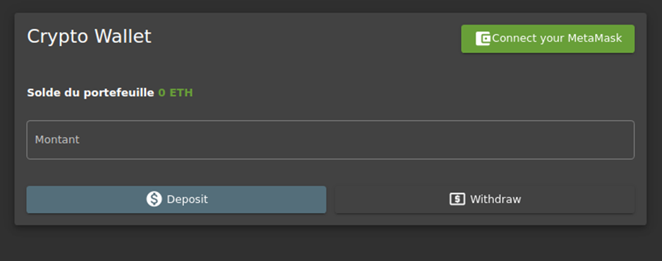
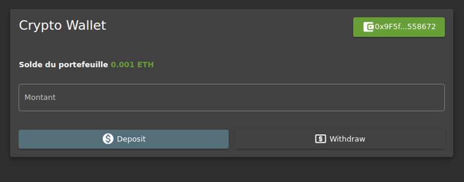
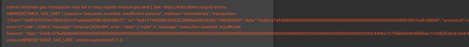

# Juice-Shop Write-up: Wallet Depletion

## Challenge Overview

**Title:** Wallet Depletion  
**Category:** Cryptographic Issues  
**Difficulty:** ⭐⭐⭐⭐⭐⭐ (6/6)

This challenge entails draining or manipulating the balance of a simulated cryptocurrency wallet within the Juice Shop application by intercepting and manipulating blockchain transaction requests.

## IMPORTANT NOTE

**_This challenge is not well completed, please feel free to open a pull request if you have find a way to complete it in a proper manner._**

## Tools Used

- **Web Browser:** Used to interact with the wallet page of the Juice Shop.
- **Burp Suite:** Intercepted and manipulated the outgoing HTTP requests to and from the Juice Shop.

## Methodology and Solution

### Step 1: Exploring the Wallet Functionality

I start by visiting the wallet page on the Juice Shop site :



I interacted with the interface to deposit a small amount of ETH (0.001 ETH) to test the functionality :



### Step 2: Intercepting the Withdrawal Request

Using Burp Suite, I intercepted the network request made when attempting to withdraw ETH from the wallet. The request carried transaction data encoded in a hexadecimal format, indicating interaction with blockchain technologies, likely an Ethereum smart contract call.


### Key Observations from the Request:

- **Function Identifier:** The first part of the data field in the transaction (`0x2e1a7d4d`) identifies which function of the smart contract is called. This ID is a hash slice of the function signature.
- **Parameters:** Following the function identifier, the second part is the hexadecimal number that represents the amount of wei (sub-unit of ETH) to be withdrawn.

### Step 3: Decoding and Manipulating the Request

The intercepted request had a parameter that represented 0.001 ETH in wei format:

- **Hexadecimal Value:** `0x38d7ea4c68000`
- **Decimal Value:** `1,000,000,000,000,000` wei
- **Ether Conversion:** `0.001 ETH`

To test the boundaries of this functionality, I altered the parameter to increase the withdrawal amount. I recalculated the hex value for a larger amount, such as 0.1 ETH, and modified the request accordingly.

### Step 4: Resending the Modified Request

After encoding the desired withdrawal amount (0.1 ETH) into the hexadecimal format required by the transaction data, I updated the request and resent it using Burp Suite.

Here is the payload used : 
```
"data":"0x2e1a7d4d000000000000000000000000000000000000000000000000016345785d8a0000"
```

### Challenges Faced:

Attempting to withdraw 0.1 ETH resulted in an error likely due to insufficient funds or protections against unauthorized withdrawal amounts. The specific error highlighted the transaction could fail due to an "UNPREDICTABLE_GAS_LIMIT."



## Solution Explanation

The challenge illustrated the risk associated with client-side controls in cryptocurrency transactions. By intercepting and manipulating transaction data, it is theoretically possible to initiate unauthorized actions if not adequately checked server-side.

## Remediation

- **Server-side Validation:** Always validate transaction requests server-side to ensure that they meet all necessary criteria (e.g., correct parameters, sufficient balance).
